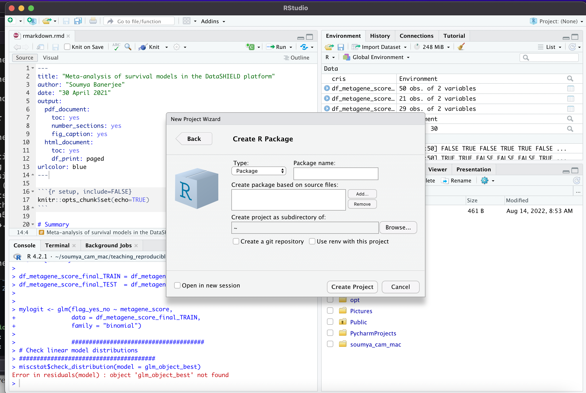
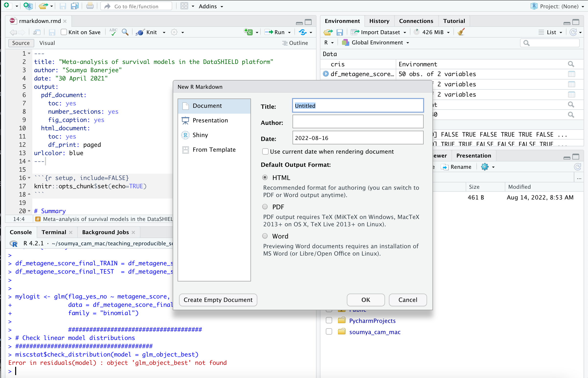
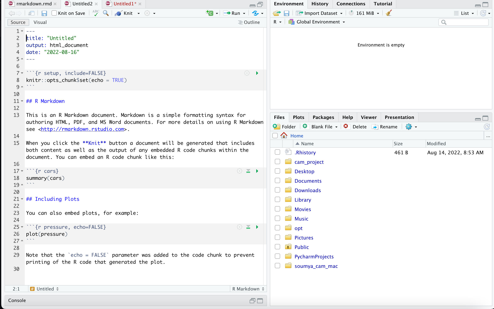
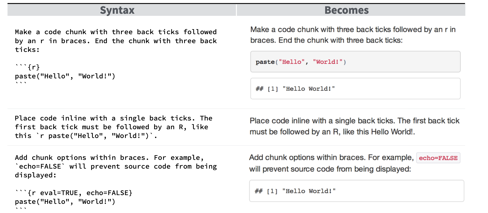
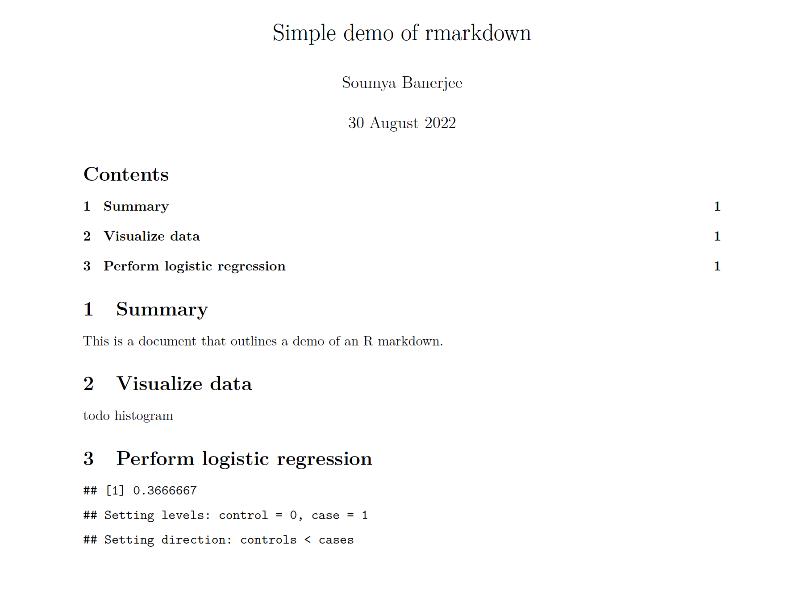

# teaching_reproducible_science_R

[](https://www.gnu.org/licenses/gpl-3.0.html)


## Introduction

Material, notes and code for teaching reproducible science and pipelines in R. 

## Installation

* Install R

    https://www.r-project.org/

* and R Studio

https://www.rstudio.com/products/rstudio/download/preview/

* Install the following packages in R:

```r
install.packages('rmarkdown')
install.packages('knitr')
install.packages('tinytex')
install.packages('sqldf')
install.packages('ggplot2')
install.packages('gplots')
install.packages('lme4')
install.packages('lmerTest')
install.packages('pROC')
install.packages('precrec')
install.packages('PRROC')
install.packages('boot')
install.packages('mlbench')
install.packages('caret')
install.packages('rpart')
install.packages('partykit')
install.packages('rlib')
devtools::install_github('neelsoumya/rlib')
install.packages('multcomp')
install.packages('lsmeans')
install.packages('moments')

```

* Download a zip file of this repository and unzip it

or

clone it 

```r
git clone https://github.com/neelsoumya/teaching_reproducible_science_R

cd teaching_reproducible_science_R
```

* Go to this new directory and set working directory to this directory in R.

```r
setwd('~/teaching_reproducible_science_R')
```

* In R studio, run the markdown


`rmarkdown.rmd`

https://github.com/neelsoumya/teaching_reproducible_science_R/blob/main/rmarkdown.rmd


## Template code

`rmarkdown.rmd`

https://github.com/neelsoumya/teaching_reproducible_science_R/blob/main/rmarkdown.rmd

Running this will create a report like the following:

https://github.com/neelsoumya/teaching_reproducible_science_R/blob/main/rmarkdown.pdf


## Exercises

* Create an Rmarkdown for the Boston housing dataset. See the tutorial below and just load and plot the data.

https://medium.com/analytics-vidhya/a-simple-ml-project-in-r-using-the-boston-dataset-e1143146ffb0

* A simple script to help you get started is here `simple_script.R`

https://github.com/neelsoumya/teaching_reproducible_science_R/blob/main/simple_project.R


## Resources and further reading

https://rmarkdown.rstudio.com/lesson-1.html

https://bookdown.org/yihui/rmarkdown-cookbook/

https://ropensci.org/

https://bookdown.org/home/

https://github.com/neelsoumya/dsSurvival_bookdown

https://www.coursera.org/learn/r-programming

https://swcarpentry.github.io/r-novice-gapminder/guide/index.html


## Lecture notes outline

* Your data, your model decisions, parameters and your data filtering decisions will keep on changing. How do you know 6 months later what has changed? Document your code and your output and your design decisions all in one place.

* Reproducible pipeline

* Know exactly what changed and when

* Know how to rerun the analysis and get the (same) results

* This is like your research notebook

* Some experiences/case studies of using Rmarkdown notebooks and helping biologists use them to analyze their own data (30 minute talk)

* When you are deep in your work, it can be difficult to make code pretty, comment it and make it reproducible. But you will regret not doing this when you park the work and 6 months later your colloaborators/reviewers ask for additional analysis or changing some assumption, etc. Your code should then be ready (you should be able to click a button and reproduce the figures for your paper). 

* Example of IL10 project (tSNE and heatmaps from a bioinformatics project)


* You can easily create R packages or Rmarkdown documents in R Studio (see screenshots in this folder/repository and below)





* The concepts are the same in any programming language (R/Python)

* Bottomline: we are all busy and we would all rather publish papers, but in the long term these best practices will make us more productive

* This is like protocols (used in experimental biology) for computer scientists. Also like a lab notebook but for computational people.

* You can also write an entire paper in R markdown, where each figure is generated from the code

* A short demonstration in R studio of how to create an R markdown document

* A bridge into R and Python: issues with each (Ahmad and Soumya). Issues with each.

# Code examples 

* A very simple R markdown will look like the following




* Here are some very simple commands that you use to generate your document (you write your code in R and it gets compiled into a document like PDF)



See the link below for more details

https://www.rstudio.com/wp-content/uploads/2015/03/rmarkdown-reference.pdf

* Now head over to the file named `rmarkdown.rmd`

https://github.com/neelsoumya/teaching_reproducible_science_R/blob/main/rmarkdown.rmd

Running this will create a report like the following:

https://github.com/neelsoumya/teaching_reproducible_science_R/blob/main/rmarkdown.pdf





* A typical header of a R markdown file will look like

```r

---

title: "Analysis and Writeup"

header-includes:

- \usepackage{placeins}

- \usepackage{float}

- \floatplacement{figure}{H}

output:

  pdf_document:

    fig_caption: yes

    keep_tex: yes

    latex_engine: xelatex

    number_sections: yes

  word_document: default

  html_document:

    df_print: paged

bibliography: Periphery_project.bib

urlcolor: blue

---

```{r include=FALSE}

knitr::opts_chunk$set(echo = TRUE)

knitr::opts_chunk$set(cache = TRUE)

knitr::opts_chunk$set(warning = FALSE)

knitr::opts_chunk$set(out.extra = '')

#knitr::opts_chunk$set(fig.pos = 'H')

```

\begin{centering}

\vspace{3 cm}

\Large

\normalsize

Soumya Banerjee, `r format(Sys.time(), "%b %d %Y")`

\vspace{3 cm}

\end{centering}

\setcounter{tocdepth}{2}

\tableofcontents

\newpage

```{r,include=FALSE}

library(knitr)

library(gridExtra)

library(rmarkdown)

# EQUATIONS in rmarkdown

$$ eGFR = eGFR_{0} + b_{before}*t_{before} $$

```

Italics in rmarkdown using *metafor*

Code can be rendered or shown in rmarkdown using

```

dsBaseClient::ds.summary(x='surv_object')

```

```{r, include=FALSE}

# Load packages and settings

library(sqldf)

library(ggplot2)

library(knitr)

library(rmarkdown)

library(gplots)

library(RColorBrewer)

library(png)

library(grid)

library(gridExtra)

library(lme4)

library(lmerTest)

library(rpart)

```

```{r, echo=FALSE}

# code here

```


## Contact

Soumya Banerjee

sb2333@cam.ac.uk


[](https://www.gnu.org/licenses/gpl-3.0.html)
